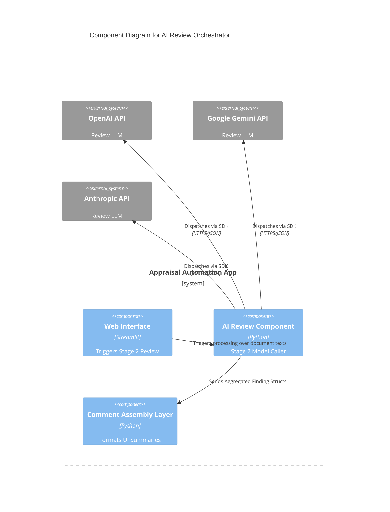

# Component: AI Review Orchestrator

## 1. Overview
- **Name:** AI Review Orchestrator
- **Description:** A parallelized LLM processing factory that uploads texts to various LLM providers (Anthropic, OpenAI, Google Gemini) to identify spelling, phrasing, and logical consistency errors in the document.
- **Type:** Multi-Agent Client Service
- **Technology:** Python, Pydantic, HTTP Rest Clients, Concurrent Futures

## 2. Purpose
Automates the critique of Appraisal Documents. Instead of one massive prompt, it divides attention into specialized Agents (Phrasing, Logic, Spelling) across multiple providers depending on A/B test parameters (e.g. `gemini-3-flash`, `o3-mini`). Provides highly structured constraint-based outputs ready for programmatic handling.

## 3. Software Features
- **Concurrent Dispatch:** Fires multiple API calls simultaneously over `ThreadPoolExecutor` targeting specific vendor APIs.
- **Multi-Agent Prompts:** Contains heavily engineered instructions that force LLMs to identify the severity (`high`, `medium`, `low`) and categorizations of bugs.
- **Findings Aggregation:** Pulls the outputs together and intelligently merges overlaps (e.g. joining 3 minor spelling bugs on paragraph 10 into one single merged comment).
- **Structured Data Enforcement:** Relies on Pydantic `BaseModel` classes with `strict=True` modes to guarantee the JSON API responses map flawlessly to the Word comments system.

## 4. Code Elements
- [stage2_review.py](file:///d:/Antigravity%20projects/RAMI%20PROJCT/rami_project/C4-Documentation/c4-code-appraisal-automation.md) - Orchestrates the full Stage 2 pipeline.
- [agents/](file:///d:/Antigravity%20projects/RAMI%20PROJCT/rami_project/C4-Documentation/c4-code-appraisal-automation-agents.md) - Sub-package defining the reviewer logic, prompt texts, and findings aggregation definitions.
- [comment_injector.py](file:///d:/Antigravity%20projects/RAMI%20PROJCT/rami_project/C4-Documentation/c4-code-appraisal-automation.md) - Acts as the handoff layer, taking the aggregated findings and formatting them into emojis/templates for the DOCX Engine.

## 5. Interfaces
- **Entry Method:** `run_stage2_with_progress(file_obj)`
- **External Network Hooks:** Reaches out over HTTPS to Anthropic/OpenAI/Google GenAI networks using their standard Python SDK packages to await ChatCompletions.

## 6. Dependencies
- **Components Used:**
  - DOCX Engine Component (To parse text before review, and inject comments after review).
- **External Systems:**
  - OpenAI / Anthropic / Google Vertex/Gemini AI API endpoints.

## 7. Component Diagram

