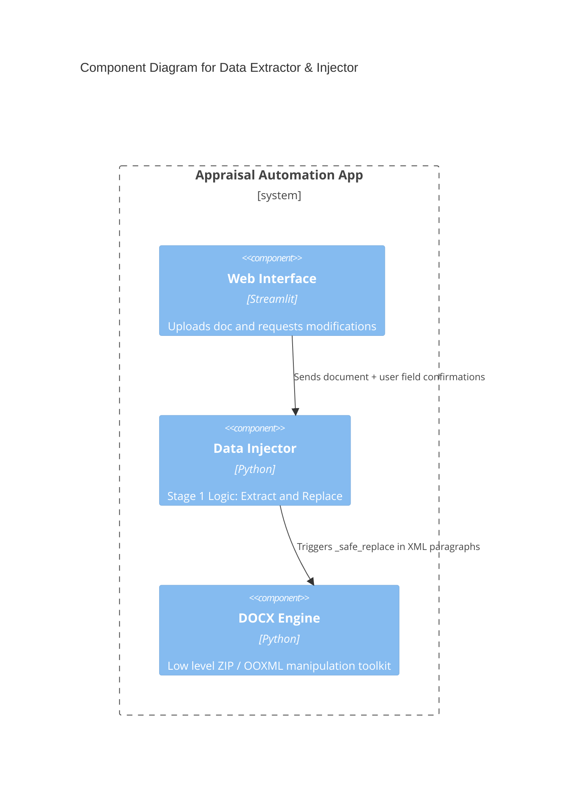

# Component: Data Extractor & Injector

## 1. Overview
- **Name:** Data Extractor & Injector
- **Description:** The Stage 1 logic responsible for automatically reading legacy Hebrew appraisal cover pages and performing mass value replacements intelligently across the document.
- **Type:** Backend Core Library
- **Technology:** Python, python-docx

## 2. Purpose
Saves the user hours of manual typing by reading the front cover for values (like "גוש", "חלקה") and running a safe global find-and-replace so that numbers/entities are perfectly synchronized down to the exact paragraph text node.

## 3. Software Features
- **Field Extraction:** Dynamically reads paragraph-based cover pages hunting for `label: value` mappings, specifically tailored for Israeli appraisal docs.
- **Global Replacement:** Performs safe boundary-checked search/replace against unpacked XML texts to replace only matching whole numbers/words.
- **Cleanup:** Strips empty `_____` lines from templates, compacting the layout.

## 4. Code Elements
- [field_extractor.py](file:///d:/Antigravity%20projects/RAMI%20PROJCT/rami_project/C4-Documentation/c4-code-appraisal-automation.md) - Parses raw Word files using user-level parsers to identify fields.
- [stage1_inject.py](file:///d:/Antigravity%20projects/RAMI%20PROJCT/rami_project/C4-Documentation/c4-code-appraisal-automation.md) - Replaces content safely back into the raw XML format.

## 5. Interfaces
- **Extraction Function:** `extract_cover_fields(file)` -> returns mapping dict.
- **Injection Pipeline:** `run_stage1(file, fields_to_change)` -> returns path to modified zip/docx.

## 6. Dependencies
- **Components Used:**
  - DOCX Manipulation Engine (for modifying internal XML)
- **External Systems:** `python-docx` library.

## 7. Component Diagram

