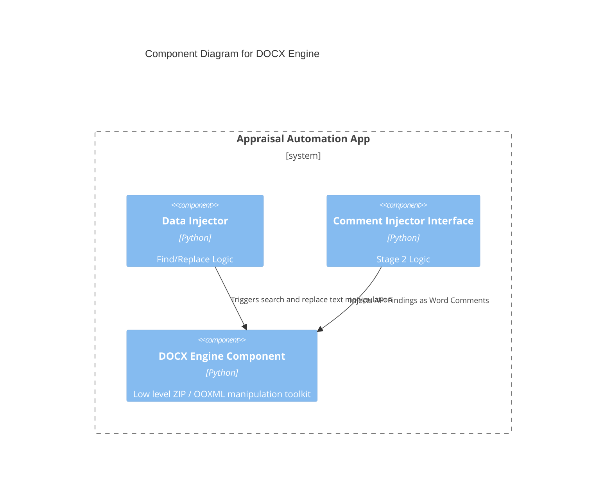

# Component: DOCX Engine

## 1. Overview
- **Name:** DOCX Engine
- **Description:** A robust, low-level integration component for tearing down `.docx` files into their raw OOXML elements, executing targeted structural edits, resolving indices, and packing them safely back up.
- **Type:** Local File Processor Engine
- **Technology:** Python, lxml, Base ZIP

## 2. Purpose
Provides the foundational file editing capability for both Stage 1 (Find/Replace) and Stage 2 (Comment Injection). Deals with the messy reality of Word's paragraph fragmentation, encoding, and style management so higher-level business logic doesn't have to look at raw XML strings.

## 3. Software Features
- **Unpack/Pack:** Flattens `.docx` into localized temporary disks, runs XML validations using `lxml`, and repacks securely using `zipfile.ZIP_DEFLATED`.
- **Run Merging:** Detects fragmented `<w:r>` (runs) inside an XML `<w:p>` (paragraph) with identical styling and merges them. Highly critical for string replacement stability.
- **Section Parsing:** Reads raw XML styles (`<w:pStyle w:val="*">`) and derives human-friendly paragraph numbering indices and heading contexts.
- **Rich Markdown Formatting:** Iterates over every table and paragraph, outputting Markdown equivalents to feed to modern LLMs (giving LLMs structural awareness).
- **Comment Injection:** Injects OOXML Comment boundaries (`<w:commentRangeStart>`, `<w:commentReference>`) to append API findings directly into the finalized document margins.

## 4. Code Elements
- [docx_utils.py](file:///d:/Antigravity%20projects/RAMI%20PROJCT/rami_project/C4-Documentation/c4-code-appraisal-automation.md) - The central utility hub wrapping raw file ops.
- [section_mapper.py](file:///d:/Antigravity%20projects/RAMI%20PROJCT/rami_project/C4-Documentation/c4-code-appraisal-automation.md) - Context generator from raw styles to text headers.
- [scripts/office/](file:///d:/Antigravity%20projects/RAMI%20PROJCT/rami_project/C4-Documentation/c4-code-appraisal-automation-scripts-office.md) - Raw sub-package implementing unpack, pack, and `comment.py` logic.

## 5. Interfaces
- **Extraction Methods:** `docx_unpack`, `get_paragraph_texts`, `get_rich_markdown`
- **Injection Methods:** `docx_pack_safe`, `replace_throughout_document`, `inject_comments_batch`

## 6. Dependencies
- **Components Used:** None. This is the lowest-level capability of the application locally.
- **External Systems:** The local filesystem (temp directory) and Python `lxml`.

## 7. Component Diagram

