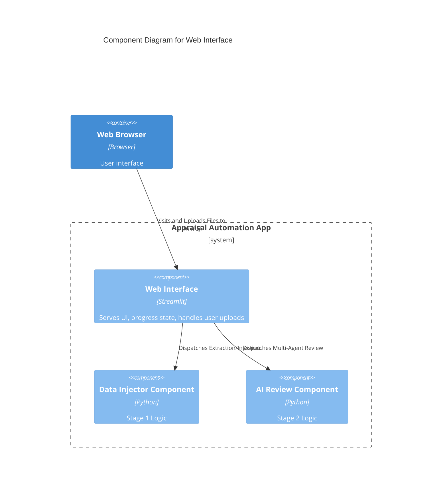

# Component: Web Interface

## 1. Overview
- **Name:** Web Interface
- **Description:** The primary graphical dashboard built with Streamlit allowing end users to interact with both the Data Injection (Stage 1) and AI Review (Stage 2) workloads.
- **Type:** Web Application
- **Technology:** Python, Streamlit

## 2. Purpose
Serves as the front-end for users to upload DOCX files, manage detected fields for data replacement, and send final documents to the AI reviewer. It surfaces visual feedback, live progress indicators, debug data, and modified file downloads. It includes basic password gating for authorization.

## 3. Software Features
- **Stage 1 Dashboard:** Handles DOCX uploads, runs the Field Extractor, displays results in interactive text fields, and invokes Data Injector.
- **Stage 2 Dashboard:** Uploads modified DOCX, triggers AI Review Orchestrator asynchronously showing live updates, and provides the fully commented DOCX for download.
- **Security Check:** Simple static password protection gating entry to the tool (`APP_PASSWORD`).

## 4. Code Elements
- [app.py](file:///d:/Antigravity%20projects/RAMI%20PROJCT/rami_project/C4-Documentation/c4-code-appraisal-automation.md) - Main interface logic.

## 5. Interfaces
- **Streamlit Web View:** The HTTP front end dynamically rendered via Streamlit Server for users.
- **File Uploader:** Exposes memory buffers of uploaded Word documents to internal orchestrators.

## 6. Dependencies
- **Components Used:**
  - Data Extractor & Injector
  - AI Review Orchestrator
- **External Systems:** Streamlit Framework

## 7. Component Diagram

