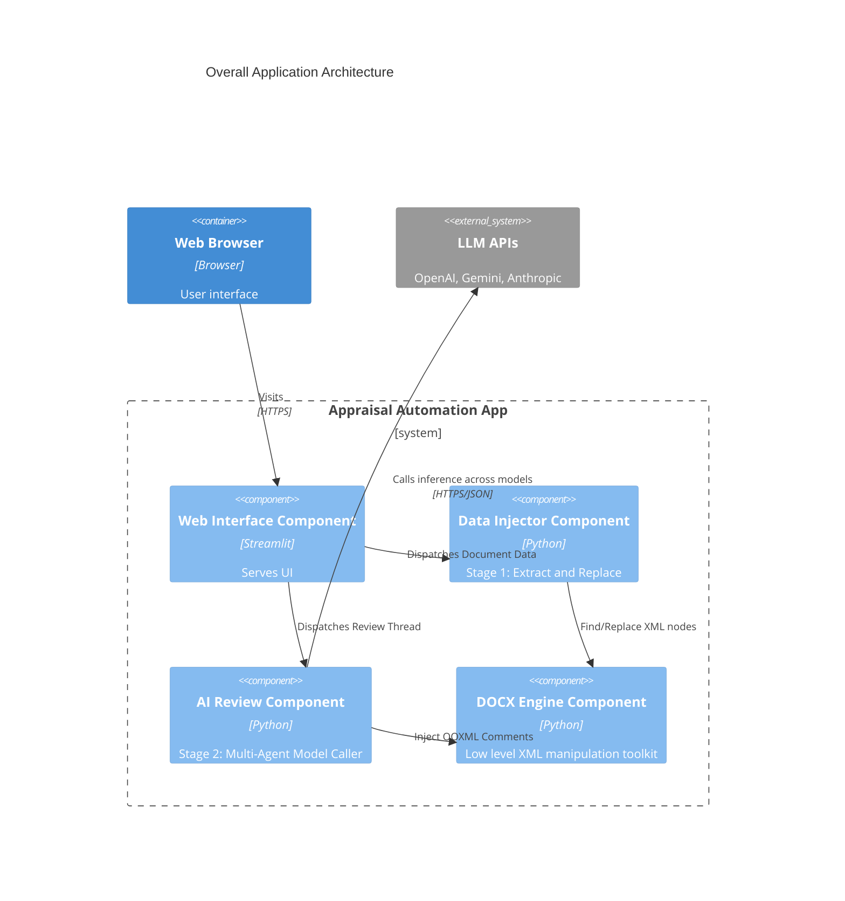

# Component Architecture: Appraisal Automation

This document synthesizes the code-level analysis into high-level logical components, explaining how they map to the overall file structure and architecture.

## 1. Component Synthesis Strategy
The `appraisal-automation` project is split essentially into two primary capabilities wrapped within a UI. Given the heavy reliance on complex file manipulation alongside complex API interactions, the architecture naturally breaks into the following four components:

1. **Web Interface** (Frontend Layer)
2. **Data Extractor & Injector** (Stage 1 Capability Layer)
3. **AI Review Orchestrator** (Stage 2 Capability Layer)
4. **DOCX Engine** (Low-Level Persistence/Infrastructure Layer)

## 2. Component Layout

### Web Interface Component
- **Reference:** [c4-component-web-interface.md](file:///d:/Antigravity%20projects/RAMI%20PROJCT/rami_project/C4-Documentation/c4-component-web-interface.md)
- **Role:** Handles file uploading, form state, execution triggers, downloading, and general progression flow. Completely abstracted from the nasty internal DOCX API rules.
- **Files Included:**
  - `app.py`
  - `config.py`

### Data Extractor & Injector Component
- **Reference:** [c4-component-data-injector.md](file:///d:/Antigravity%20projects/RAMI%20PROJCT/rami_project/C4-Documentation/c4-component-data-injector.md)
- **Role:** Implements the "Stage 1" business rules: sniffing for forms on Hebrew report covers, resolving document types, and deploying precise replacement rules across paragraphs globally.
- **Files Included:**
  - `field_extractor.py`
  - `stage1_inject.py`

### AI Review Orchestrator Component
- **Reference:** [c4-component-ai-review.md](file:///d:/Antigravity%20projects/RAMI%20PROJCT/rami_project/C4-Documentation/c4-component-ai-review.md)
- **Role:** Implements the "Stage 2" multi-agent workflows. Distributes textual analysis over multiple prompts simultaneously and aggregates JSON responses into a coherent finding dataset.
- **Files Included:**
  - `stage2_review.py`
  - `agents/reviewer.py`
  - `agents/aggregator.py`
  - `agents/prompts.py`
  - `comment_injector.py`

### DOCX Engine Component
- **Reference:** [c4-component-docx-engine.md](file:///d:/Antigravity%20projects/RAMI%20PROJCT/rami_project/C4-Documentation/c4-component-docx-engine.md)
- **Role:** The foundational structural layer representing filesystem packing, zip logic, XML traversal, unicode merging heuristics, and physical insertion of comment nodes.
- **Files Included:**
  - `docx_utils.py`
  - `section_mapper.py`
  - `scripts/office/unpack.py`
  - `scripts/office/pack.py`
  - `scripts/office/comment.py`

## 3. High Level Component Architecture

