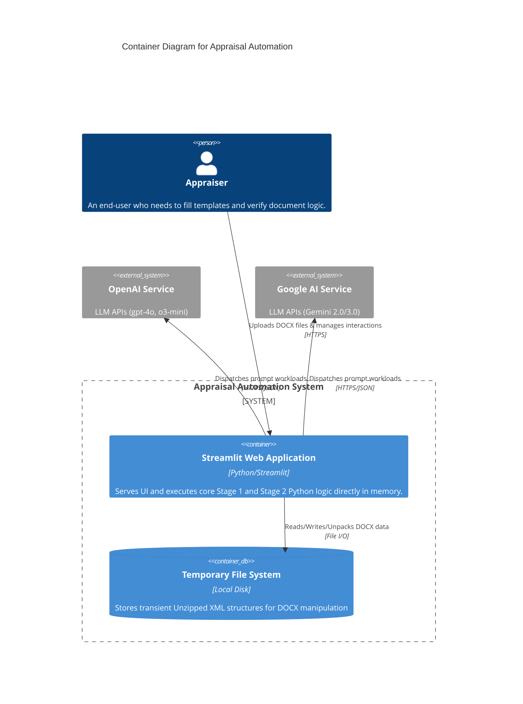

# Container Architecture

## 1. Overview
- **Name:** Appraisal Automation Software System
- **Description:** A monolithic Streamlit web application running locally or on Streamlit Cloud that provides document data injection and multi-agent AI verification for Israeli Appraisal documents.

## 2. Containers

### Streamlit Web Application
- **Type:** Web Application / Server-Side Container
- **Technology:** Python 3.12+, Streamlit, FastAPI (via Streamlit runtime), python-docx, lxml
- **Description:** The core application. Serves the browser-based UI to users while executing heavy Python logic on the server backend. It encapsulates the Data Extractor/Injector, DOCX Document Engine, and AI Review Orchestrator within its execution context. 
- **Responsibilities:**
  - Rendering Web UI for user interaction.
  - Temporarily storing uploaded DOCX files on the local filesystem (`_temp/` directory) for XML untarring and packing.
  - Enforcing basic static password security (`APP_PASSWORD`).
  - Serving as an HTTP integration client calling out to external AI APIs seamlessly.

### File System
- **Type:** Local File Storage
- **Technology:** OS File System
- **Description:** An ephemeral storage container on the host machine running the Streamlit app. 
- **Responsibilities:**
  - Persisting `.docx` files during the unzip/zip lifecycles required to tamper with OOXML safely.

## 3. External Systems
- **OpenAI API:** External REST API for executing complex model reviews via `gpt-4o` and `o3-mini`.
- **Google Gemini API:** External REST API for fast, large-context structural reviews via `gemini-3-flash-preview` and `gemini-2.0-flash`.
- **Anthropic API:** (Optional/Fallback capability defined in legacy configs) External REST API.

## 4. Container Diagram

## 5. API Specifications
*(No persistent internal APIs exposed. All communication internally is Python function calls within the monolith. All external APIs consumed are standardized public LLM endpoint structures).*
