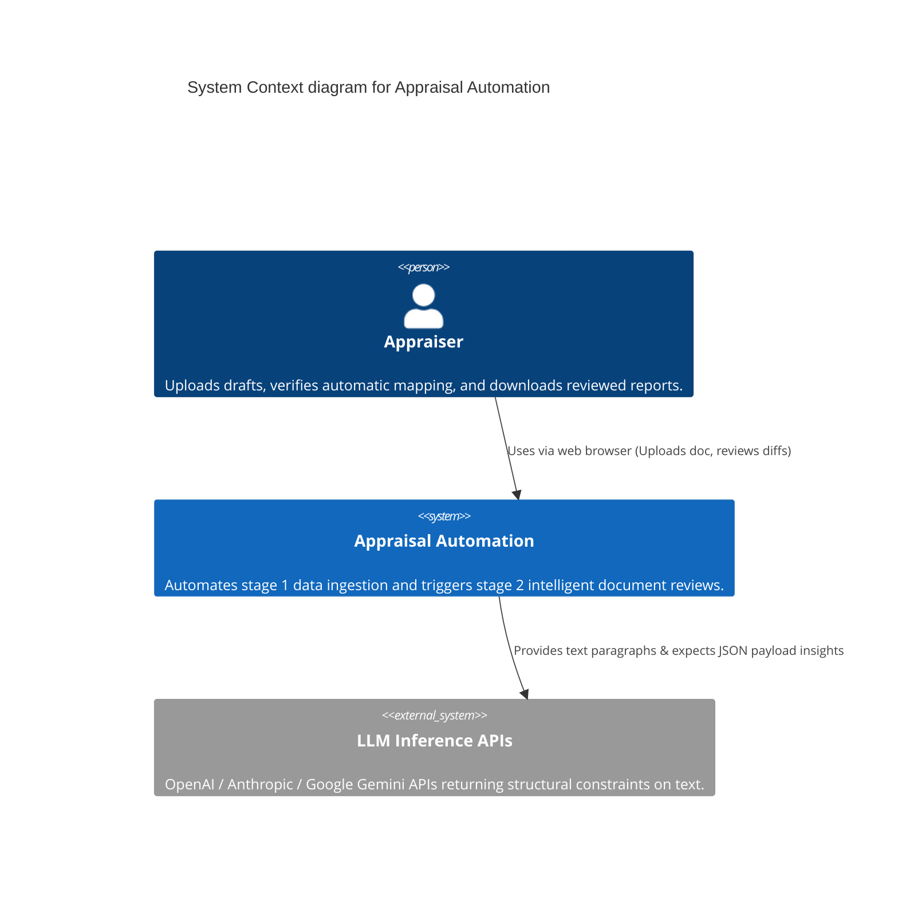

# Context Architecture

## 1. Overview
- **Name:** Appraisal Automation Platform
- **Description:** A system designed to help users (Appraisers) extract data constraints from standard Hebrew property valuation documents, mass-replace missing data smoothly across complicated XML formats, and get AI-assisted semantic spelling/logic reviews prior to delivery.

## 2. Personas / Roles
- **Appraiser (User):** Needs to upload DOCX files to safely synchronize numbers/entities and execute an unbiased multi-agent spelling and cross-consistency check.

## 3. External Systems
- **LLM APIs (OpenAI, Google Gemini):** Cloud-hosted inference providers called out to asynchronously for contextual text critiques. Returns strict JSON.

## 4. Context Diagram

## 5. Scope Boundaries
The Automation Platform relies completely on temporary File Systems locally or in Streamlit Cloud. It maintains zero permanent user data persistence between refresh sessions. The external context boundary ends strictly at standard generic REST API interfaces for Language Models. All actual logic dictating the "business rules" (Hebrew string extraction, spelling prompt strictness, DOCX zip structures) resides entirely inside the App context.
